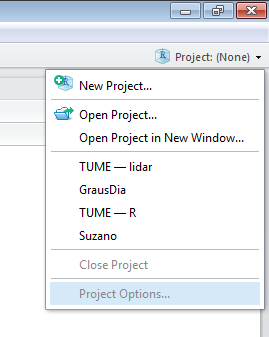
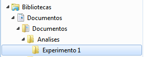
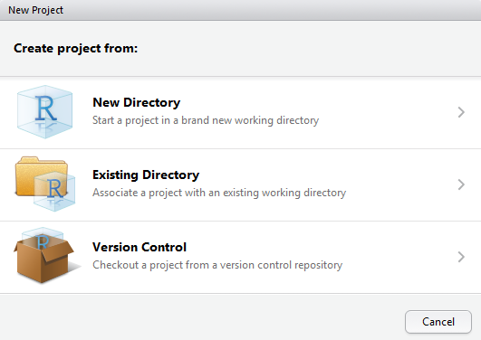
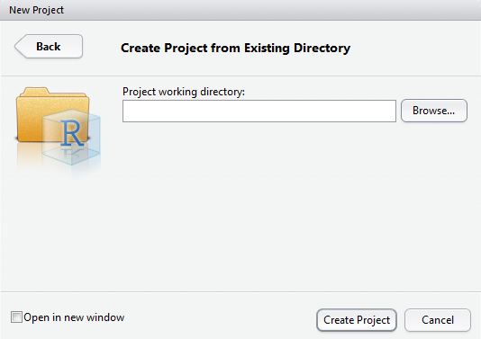
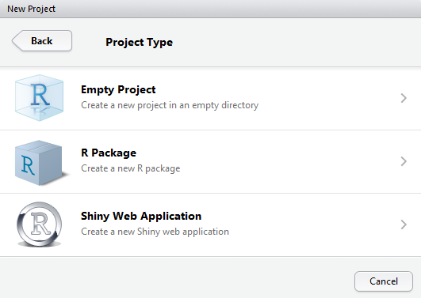
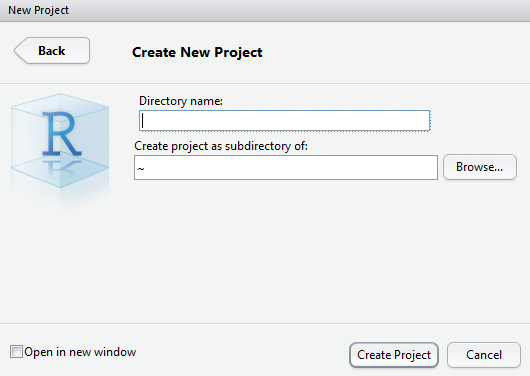
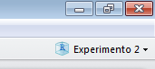

# Trabalhando com o R

Neste capítulo você verá:

- Salvar e exportar: \@ref(salvar)
	- Salvar o script: \@ref(savescript)
	- Exportar figuras e resultados: \@ref(exportar)
	- Projeto vinculado a uma pasta existente: \@ref(pasta)
	- Projeto vinculado a uma nova pasta: \@ref(nova)
	- Abrir um projeto existente: \@ref(existente)
- Estilos de programação: \@ref(estilo)

## Salvar e exportar {#salvar}

Neste momento, você já teve um primeiro contato com a linguagem R e deve estar ansioso para utilizá-la no dia-a-dia. Nos próximos capítulos, colocaremos a mão na massa para conduzir uma sequência de análises gráficas e exploratórias.

Ao abrir o RStudio pela primeira vez, note que no canto superior esquerdo haverá ícone informando que não há um espaço de trabalho aberto (Project: None):
 
```{r workspace1,fig.cap="Informação sobre o espaço de trabalho no RStudio.", out.width='40%', fig.asp=.75, fig.align='center', echo=FALSE}

knitr::include_graphics('img/cap8fig1.png')
``` 
 
Acostume-se a sempre realizar uma das duas alternativas abaixo:

- Ou abrir um espaço de trabalho já existente (Open Project)
- Ou criar um novo espaço de trabalho (New Project)

```{r workspace2,fig.cap="Menu para manipulação do espaço de trabalho.", out.width='50%', fig.asp=.75, fig.align='center', echo=FALSE}


``` 
 
A regra geral é: opte por criar um novo espaço de trabalho, sempre que você for iniciar uma análise. Opte por abrir um espaço de trabalho já existente quando você quiser continuar ou modificar uma análise anteriormente realizada. Para entender melhor as opções relacionadas ao espaço de trabalho, vamos nos basear em três cenários diferentes.


Imagine que queremos fazer a análise estatística de um experimento no R. Os dados coletados desse experimento estão digitados dentro de uma planilha eletrônica, salvo numa pasta chamada Experimento 1, no seguinte endereço:

C:\Users\egorgens\Documents\Analises\Experimento 1

Cuja árvore pode ser vista na figura abaixo:

```{r workspace3,fig.cap="Exemplo de uma estrutura de pastas de um computador.", out.width='30%', fig.asp=.75, fig.align='center', echo=FALSE}


``` 	
	
### Salvar o script {#savescript}


### Exportar figuras e resultados {#exportar}


### Projeto vinculado a uma pasta existente {#pasta}
 
Neste exemplo já temos um diretório criado no computador contendo o arquivo que queremos analisar. Desta forma, ao abrir o RStudio, basta avisarmos para o programa que nosso espaço de trabalho é o diretório no qual os dados estão salvos. Os passos seriam:

1. Clique na lista suspensa ao lado do Project: (None).
2. Clique em New Project.

```{r workspace4,fig.cap="Menu para criar um espaço de trabalho.", out.width='40%', fig.asp=.75, fig.align='center', echo=FALSE}

knitr::include_graphics('img/cap8fig4.png')
``` 

3. Clique em Existing Directory.

```{r workspace5,fig.cap="Opções para criar um novo espaço de trabalho.", out.width='40%', fig.asp=.75, fig.align='center', echo=FALSE}


``` 

4. Através do botão Browse, selecione o diretório do Experimento 1 e clique em Create Project.

```{r workspace6,fig.cap="Opção para criar um espaço de trabalho a partir de um diretório já existente.", out.width='40%', fig.asp=.75, fig.align='center', echo=FALSE}


``` 
 
Perceba agora, que o espaço de trabalho está definido e amarrado ao diretório do Experimento 1.
 
```{r workspace7,fig.cap="Espaço de trabalho vinculado.", out.width='40%', fig.asp=.75, fig.align='center', echo=FALSE}

knitr::include_graphics('img/cap8fig7.png')
``` 

### Projeto vinculado a uma nova pasta {#nova}
 
Imagine agora que queremos fazer a análise estatística de um segundo experimento no R. Os dados coletados desse experimento acabaram de chegar por email e ainda não estão salvos numa pasta de trabalho. Assim, desejamos criar uma pasta para o Experimento 2 e ao mesmo tempo amarrar o espaço de trabalho a esta pasta criada. Os passos seriam:

1. Clique na lista suspensa ao lado do Project: (None).
2. Clique em New Project.

```{r workspace8,fig.cap="Menu para manipulação do espaço de trabalho.", out.width='40%', fig.asp=.75, fig.align='center', echo=FALSE}


``` 

3. Clique em New Directory.

```{r workspace9,fig.cap="Opções para criar um novo espaço de trabalho.", out.width='40%', fig.asp=.75, fig.align='center', echo=FALSE}


``` 

4. Clique em projeto vazio (Empty Project).

 ```{r workspace10,fig.cap="Opção para criar um espaço de trabalho sem vinculo com diretório existente.", out.width='40%', fig.asp=.75, fig.align='center', echo=FALSE}


``` 

5. Dê o nome do diretório a ser criado e o local do seu computador onde este diretório ficará salvo. Finalize a criação clicando em Create Project.

 ```{r workspace11,fig.cap="Criar um espaço de trabalho a partir de um novo diretório.", out.width='40%', fig.asp=.75, fig.align='center', echo=FALSE}


``` 
 
Perceba agora, que o espaço de trabalho está definido e amarrado ao diretório do Experimento 2.

```{r workspace12,fig.cap="Espaço de trabalho vinculado.", out.width='40%', fig.asp=.75, fig.align='center', echo=FALSE}


```
 
```{remark}
Toda vez que o RStudio for iniciado, será exibido o último espaço de trabalho salvo. Altere sempre para associar a análise que você irá fazer com o espaço de trabalho correto.
```

### Abrir um projeto existente {#existente}

Agora, suponha que você deseja continuar a análise do Experimento 1. Mas o espaço de trabalho ativo é o experimento 2. Neste caso, basta:

1. Clique na lista suspensa ao lado do Experimento 1, no canto superior direito.
2. Clique em Open Project.

```{r workspace13,fig.cap="Menu para manipulação do espaço de trabalho.", out.width='40%', fig.asp=.75, fig.align='center', echo=FALSE}

knitr::include_graphics('img/cap8fig13.png')
```

3. Escolha um projeto salvo anteriormente.

Você conseguirá utilizar o RStudio mesmo sem definir o espaço de trabalho. No entanto, existem alguns benefícios quando quando definimos o espaço de trabalho:

- Toda análise (tabelas e gráficos) quando exportada é salva automaticamente na pasta vinculada ao espaço de trabalho.
- O RStudio enxerga automaticamente os arquivos existentes dentro da pasta sem a necessidade de informar o endereço completo quando realizar uma manipulação de arquivo (ex: importar uma planilha).
- Ao salvar o espaço de trabalho, é possível salvar o histórico (History) e as variáveis armazenadas na memória (Environment).

## Estilos de programação {#estilo}