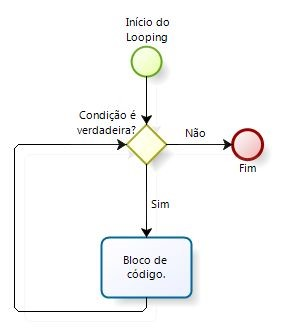
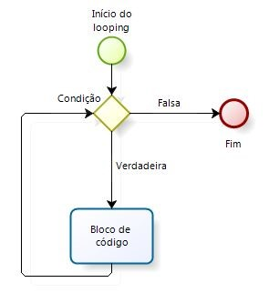

# Estruturas de laço e suas aplicações

Neste capítulo você verá:

- Laço **while**: \@ref(while)
- Laço **for**: \@ref(for)
- Família **apply** \@ref(apply)
- Pacote **dplyr** \@ref(dplyr)


## Laço **while** {#while}

Estrutura de laço while é uma estrutura de desvio do fluxo presente em linguagens de programação que repete um determinado algoritmo enquanto uma condição se mantiver verdadeira.

```{r while1,fig.cap="Estrutura do laço While", out.width='50%', fig.asp=.75, fig.align='center', echo=FALSE}


```

Estão associados à estrutura de repetição while uma condição e um bloco de código. Após o final da execução do bloco, a condição é verificada, e caso ela ainda seja verdadeira, o bloco de código é executado novamente. O objetivo do laço while é repetir uma determinada tarefa até que uma condição não seja mais atendida.

O laço while é construído a partir da sentença genérica:

> while (condicao) {
>
>	Bloco de codigo
>
> }

A sentença acima diz ao R que irá começar um laço while, executando um bloco de código até que a condição deixe de ser atendida. Vamos criar um exemplo a partir da mesma base de dados do capítulo anterior:

```{r while2, echo = FALSE, results = 'hide'}
 arvores = data.frame(altura = c(15,18,22,24,25,30,31,34,37,39,41,45), 
                      dap = c(2,4.5,6,10,30,34,50,56,60,77.5,80,85),
                      categoria = rep(c("pequena", "grande"), each=6))
```

Nosso objetivo será calcular a área basal das árvores rotuladas como pequena. Lembrando que a área basal será a soma das áreas seccionais. Embora o laço while não seja a melhor solução para este problema, vamos implementá-lo para praticar:

```{r while3}
AB = 0
arvore = 1
rotulo = arvores$categoria[arvore]
while (rotulo == "pequena"){
	AB = AB + ((arvores[arvore, 2]^2 * pi)/40000)
	arvore = arvore + 1
	rotulo = arvores$categoria[arvore]
}
```

A condição é que a árvore que estiver sendo analisada contenha rótulo pequena, ou seja

> rotulo == "pequena"

Enquanto esta condição for verdadeira, o R executará o bloco de código que está escrito entre as chaves - { }:

> AB = AB + ((arvores[arvore, 2]^2 * pi)/40000)
> arvore = arvore + 1
> rotulo = arvores$categoria[arvore]

O bloco de código começa calculando a área seccional da arvore 1 e acrescenta o valor calculado na variável AB. Em seguida o atualiza o índice da árvore em 1, passando para a árvore seguinte do dataframe. Finalmente a terceira linha do bloco de código atualiza a variável rótulo para corresponder à nova árvore. Como o R chegou ao final do bloco de código, ele volta a testar a condição. Se a condição continuar verdadeira, o R permanece no laço; caso contrário, o R sai do laço e termina o código.

```{remark}
Vale destacar que esta solução não é facilmente aplicada às árvores rotuladas como grande. Você consegue perceber porque?
```

Aqui vale um alerta. O laço while não é muito simples de se construir e um erro pode facilmente levar a um laço perpétuo. Isto é, a condição é sempre verdadeira e portanto, o *looping while* nunca irá terminar. Esta é a razão de se preferir o laço for.

## Laço **for** {#for}

Estrutura de laço for é uma estrutura de desvio do fluxo presente em linguagens de programação que repete um determinado algoritmo para os elementos de um conjunto determinado pela condição.

```{r for1,fig.cap="Estrutura do laço While", out.width='50%', fig.asp=.75, fig.align='center', echo=FALSE}


```
 
Estão associados à estrutura de repetição for uma condição e um bloco de código. Mas ao contrário do laço while, a condição aqui serve para definir os elementos de um conjunto sobre os quais o bloco de código será executado.
Após o final da execução do bloco, se ainda houver elementos no conjunto o bloco de código é executado novamente. O objetivo do laço for é repetir uma determinada tarefa até que todos os elementos definidos pela condição tenham sido processados. O laço for é construído a partir da sentença genérica:

> for (condicao) {
> 	Bloco de codigo
> }

Vamos criar um laço for a partir da mesma base de dados que estamos utilizando nos últimos capítulos:

```{r for2, echo = FALSE, results = 'hide'}
arvores <- data.frame(altura = c(15,18,22,24,25,30,31,34,37,39,41,45), 
                      dap = c(2,4.5,6,10,30,34,50,56,60,77.5,80,85),
                      categoria = rep(c("pequena", "grande"), each=6))
```

Nosso objetivo será calcular o volume das árvores grandes. Para isto, vamos filtrar no dataframe as linhas rotuladas como grande. Sobre cada linha filtrada, iremos realizar o cálculo do volume. Vamos construir o script utilizando o laço for. O resultado do código acima será uma nova coluna no dataframe **arv.filtrada**, contendo o volume de cada árvore rotulada como grande.

```{r for3}
arv.filtrada = arvores[arvores$categoria == "grande", ]
for (i in seq(1, length(arv.filtrada$categoria), 1)) {
	arv.filtrada$volume[i] = arv.filtrada$altura[i] * (arv.filtrada$dap[i]/100) / 1.5
}
head(arv.filtrada)
```

Vamos discutir o que acabamos de fazer? Nosso script começa com:

> arv.filtrada = arvores[arvores$categoria == "grande", ]

Esta linha de comando filtra as observações do dataframe original arvores que contém a string grande nas linhas da coluna categoria. Estas observações são então salvas num novo dataframe chamado arv.filtrada. Veja a segunda linha:

> for (i in seq(1, length(arv.filtrada$categoria), 1)) {

Vamos analisar a segunda linha de forma bem cuidadosa. Com a palavra for, informamos ao R que um laço irá começar. Perceba que nosso dataframe arv.filtrada, possui 6 linhas. Esta informação vem de:

> length(arv.filtrada$categoria). 

Assim, o pedaço de código 

> seq(1, length(arv.filtrada$categoria), 1) 

define um vetor sequencial de um 1 até 6, com incrementos de 1. A segunda linha pede portanto, que o R execute um bloco de código com i variando de 1 a 6, ou seja, o bloco de código irá ocorrer sobre cada uma das linhas do dataframe arv.filtrada.

O bloco de código é bastante simples. Ele pega a altura da árvore armazenada na linha i, múltipla pelo respectiva área seccional em metros quadrados e aplica um fator de forma de 1.5. O resultado é então armazenado na mesma linha i, só que em uma nova coluna chamada volume.

```{remark}
Você seria capaz de adaptar o código para calcular o volume das árvores pequenas?
```

## Família **apply** {#apply}

No R, por usar uma linguagem vetorial, os laços tradicionais, quando possível, devem ser substituídos pelas funções da família apply. Além da função apply() propriamente dita, estão disponíveis as funções: **sapply()**, **tapply()** e **lapply()** para implementar cálculos de forma mais eficiente. 

Na base de dados que estamos trabalhando nos últimos capítulos temos duas colunas interessantes, a altura e o dap (diâmetro a altura do peito). Desejamos calcular a média dessas colunas. Assim, usaremos a função apply para aplicar função mean() (função para o calculo da média) sobre as colunas do dataframe:

```{r apply1}
apply(arvores[,1:2], 2, mean)
```

A função apply() pede três elementos. O primeiro termo: arvores[, 1:2] indica que estaremos utilizando as colunas 1 e 2 do dataframe, que corresponde às colunas altura e dap respectivamente. O segundo termo: 2 indica que desejamos aplicar a função sobre as colunas. Se utilizarmos o valor 1, a função seria aplicada sobre as linhas do dataframe. O terceiro termo, mean(), indica que a função a ser aplicada em cada coluna é a média. Prontamente o R é capaz de calcular a média das colunas altura e dap, apresentando o resultado no console:

```{r apply2}
apply(arvores[,1:2], 2, mean)
````

Lembre-se que sempre podemos salvar os resultados de uma função em uma variável. O resultado desta linha é uma variável denominada medias contendo as médias das colunas altura e dap.

```{r apply3}
medias = apply(arvores[,1:2], 2, mean)
```

As funções da família apply, em resumo, executam um laço sobre as linhas ou sobre as colunas. As funções **sapply()** e **lapply()** são variantes. A **sapply()** executa uma determinada função sobre um vetor de elementos. 

```{r apply4}
sapply(1:3, sqrt)
```

A lapply() realiza operação similar ao sapply() só que a saída é estruturada como lista.

```{r apply5}
lapply(1:3, sqrt)
```

Sempre que possível, utilize as funções da família apply. Elas são otimizadas para o R, o que a tornam bem mais eficientes que a estrutura convencional for e while.

## Pacote **dplyr** {#dplyr}