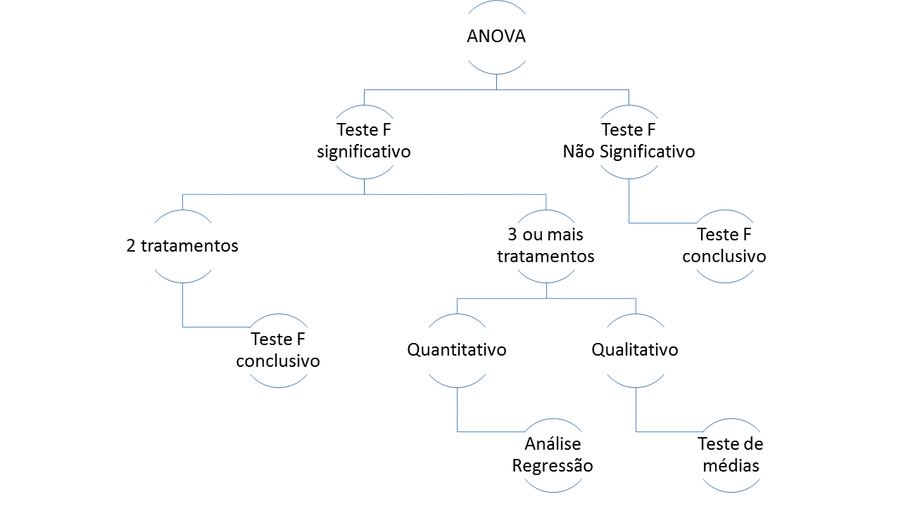

```{r setup, include=FALSE}
knitr::opts_chunk$set(echo = TRUE)
library(knitr)
```

Delineamento experimental define a organização das unidades experimentais, em função da pergunta científica que se deseja responder. Com base no delineamento escolhido, regras precisam ser seguidas, especialmente relacionados à maneira que os tratamentos são distribuídos nas unidades experimentais.

A unidade experimental é o material experimental que identifica um sistema de interesse numa pesquisa experimental e representa uma unidade da população. É sobre a unidade experimental que os tratamento serão aplicados e avaliados.

Os tratamentos são variáveis manipuladas e controladas pelo analista. Desta forma, qualquer outra influência tem que ocorrer ao acaso, e por isto, as unidades experimentais devem ser o mais homogêneas possível e o tratamento deve ser a ela atribuída de forma aleatória.

Outro ponto importante num delineamento experimental, é o número de repetições. Desta forma, deve possuir unidades experimentais suficientes para que os tratamentos sejam aplicados e repetidos. Quando maior o número de repetições, menor o intervalo de confiança e, portanto, mais precisa as inferências estatísticas. Existem metodologias específicas para a determinação do número ideal de repetições, mas na prática, adota-se trabalhos anteriores como referência, ou mesmo a disponibilidade de material acaba definindo o número de repetições.

## ANOVA

A Análise de Variância, ou simplesmente ANOVA, é uma análise estatística para determinar a contribuição de diferentes fatores na variância total de um experimento. O método foi desenvolvido em 1925 por Ronald Fisher para experimentos balanceados, ou seja, experimentos com o mesmo número de repetições em cada tratamento. No entanto, correções foram desenvolvidas para também tratar experimentos desbalanceados, como veremos mais adiante. Assim, podemos definir Análise de Variância (ANOVA) como uma técnica que decompõe a variância total e seus graus de liberdade em partes atribuídas a fatores  controlados (tratamento) e a uma outra parte associada a uma causa não controlada, também chamada de resíduo.

### Partição da variação

Suponha que estamos analisando o efeito de três materiais genéticos através de um experimento inteiramente casualizado. Cada tratamento foi formado por seis repetições (parcela), cada uma contendo 36 plantas, tratando-se assim de um experimento balanceado. Resumindo:

- 3 tratamentos (i variando de 1 a 3)
- 6 repetições por tratamento (j variando de 1 a 6)
- 18 unidades experimentais presentes no experimento

A média de altura em metros de cada uma das repetições por tratamento é:

```{r echo = FALSE, results = 'asis'}
anova.intro = read.csv('./data/anova_intro.csv')
kable(anova.intro, caption = "Dados de exemplo.")
```

```{r echo = FALSE, results = 'asis'}
anova.intro = read.csv('./data/anova_sumRep.csv')
kable(anova.intro, caption = "Média e soma de cada tratamento.")
```

```{r echo = FALSE, results = 'asis'}
anova.intro = read.csv('./data/anova_sumTotal.csv')
kable(anova.intro, caption = "Média e soma total.")
```

Vamos utilizar o R para calcular as somas - sum() e médias - mean() que faltam nas tabelas acimas. Desta forma, aproveitamos para relembrar um pouco da sintaxe, bem como dos operadores matemáticos:

```{r}
# Cria os vetores correspondentes a cada tratamentos com suas respectivas repetições
matGen1 = c(21, 20, 20, 17, 18, 17)
matGen2 = c(19, 19, 17, 13, 16, 14)
matGen3 = c(18, 18, 15, 13, 13, 13)

# Soma das repetições do tratamento 1 
s1 = sum(matGen1)
print (paste("Soma MATGEN1 = ", s1, sep = " "))

# Média das repetições do tratamento 1
m1 = mean(matGen1)
print (paste("Media MATGEN1 = ", m1, sep = " "))

# Soma das repetições do tratamento 2
s2 = sum(matGen2)
print (paste("Soma MATGEN2 = ", s2, sep = " "))

# Média das repetições do tratamento 2
m2 = mean(matGen2)
print (paste("Media MATGEN1 = ", m2, sep = " "))

# Soma das repetições do tratamento 3
s3 = sum(matGen3)
print (paste("Soma MATGEN3 = ", s3, sep = " "))

# Média das repetições do tratamento 3
m3 = mean(matGen3)
print (paste("Media MATGEN3 = ", m3, sep = " "))

# Soma de todas as repetições, dos três tratamentos
somaTotal = sum(c(matGen1, matGen2, matGen3))
print (paste("Soma total = ", somaTotal, sep = " "))

# Média de todos os tratamentos e repetições
mediaGeral = mean(c(matGen1, matGen2, matGen3))
print (paste("Media geral = ", mediaGeral, sep = " "))
```

A partir dos resultado apresentados pelo R, nossa tabela fica assim:

```{r echo = FALSE, results = 'asis'}
anova.intro = read.csv('./data/anova_sumRep2.csv')
kable(anova.intro, caption = "Média e soma de cada tratamento calculado.")
```

```{r echo = FALSE, results = 'asis'}
anova.intro = read.csv('./data/anova_sumTotal2.csv')
kable(anova.intro, caption = "Média e soma total calculado.")
```

#### Soma de quadrados total

O próximo passo será analisar a diferença de cada uma das 18 observações (3 tratamentos * 6 repetições cada) em relação à média geral:

$$desvio = x_{ij} - \bar{x}$$

em que j indica a repetição variando de 1 a 6 e i indica o tratamento variando de 1 a 3.
No R, esta operação fica fácil, pois é possível fazer de uma única vez a subtração dos elementos de um vetor pela média geral:

```{r}
desvio1 = matGen1 - mediaGeral
desvio1

desvio2 = matGen2 - mediaGeral
desvio2

desvio3 = matGen3 - mediaGeral
desvio3
```

Tabulando os desvios que calculamos acima, teríamos uma tabela da seguinte forma:

```{r echo = FALSE, results = 'asis'}
anova.intro = read.csv('./data/anova_desvio.csv')
kable(anova.intro, caption = "Desvio da observação para e média geral.")
```

Se elevarmos cada um dos desvios ao quadrado e somá-los, obtemos a soma de quadrados total (SQTotal). Esta soma de quadrados é a variação total dos dados sem levar em conta os tratamentos.

$$SQTotal = \sum (x_{ij} - \bar{x})^2$$

em que i indica a repetição variando de 1 a 6 e j indica o tratamento variando de 1 a 3. No R podemos calcular a soma de quadrados total como:

```{r}
sqTotal = sum(desvio1^2, desvio2^2, desvio3^2)
print(sqTotal)
```

#### Soma de quadrados dos tratamentos

A soma de quadrados dos tratamentos, ou a soma de quadrados entre os tratamentos, pode ser calculado pela diferença entre a média de cada tratamento em relação à média geral. 

$$desvio_{i} = \bar{x}_{i} - \bar{x}$$

em que j indica a repetição variando de 1 a 6 e i indica o tratamento variando de 1 a 3. Para isto, o valor de cada repetição é substituído pela média do seu tratamento. Isto é, através da fórmula rep, cria-se um vetor com a média do material genético repetida 6 vezes. Neste caso estamos eliminando o efeito do erro, já que cada tratamento será representado j vezes pelo valor da sua média. Finalmente, cada repetição é subtraída pela média geral.

```{r}
desvioTrat1 = rep(mean(matGen1), 6) - mediaGeral
desvioTrat1

desvioTrat2 = rep(mean(matGen2), 6) - mediaGeral
desvioTrat2

desvioTrat3 = rep(mean(matGen3), 6) - mediaGeral
desvioTrat3
```


Trazendo os resultados do R para uma tabela de desvios temos:

```{r echo = FALSE, results = 'asis'}
anova.intro = read.csv('./data/anova_desvio2.csv')
kable(anova.intro, caption = "Desvio entre a média do tratamento e média geral.")
```

Os desvios são então elevados ao quadrado e somados, resultando na soma de quadrados dos tratamentos (SQTrat):

```{r}
sqTrat = sum(desvioTrat1^2, desvioTrat2^2, desvioTrat3^2)
print(sqTrat)
```

#### Soma de quadrados dos resíduos

A soma de quadrados dos resíduos (SQRes) pode ser denominada também como soma de quadrados dentro do tratamento. Primeiro, calculamos o desvio entre a cada uma das repetições e a média do respectivo tratamento:

$$desvio = x_{ij} - \bar{x}_{i}$$

No R, podemos calcular da seguinte forma:

```{r}
desvioRes1 = matGen1 - mean(matGen1)
desvioRes1
desvioRes2 = matGen2 - mean(matGen2)
desvioRes2
desvioRes3 = matGen3 - mean(matGen3)
desvioRes3
```


Trazendo os resultados do R para uma tabela de desvios temos:

```{r echo = FALSE, results = 'asis'}
anova.intro = read.csv('./data/anova_desvio3.csv')
kable(anova.intro, caption = "Desvio da observação para e média do tratamento")
```

Elevando cada desvio ao quadrado e somando-os, calculamos a soma de quadrados dos resíduos:

```{r}
sqRes = sum(desvioRes1^2, desvioRes2^2, desvioRes3^2)
print(sqRes)
```

#### Quadrado médio

O próximo passo é montar o quadro da ANOVA e determinar os quadrados médios:

```{r echo = FALSE, results = 'asis'}
anova.intro = read.csv('./data/anova_qm.csv')
kable(anova.intro, caption = "Fórmulas para o caluclo do quandrado médio.")
```

Tanto a soma de quadrados, como os graus de liberdade são aditivos, isto é, obtendo dois termos do quadro de variância, o terceiro pode ser derivado. Na prática, calcula-se a soma de quadrados total e a soma de quadrados do tratamento.  Por diferença, obtém-se a soma de quadrados dos resíduos. O mesmo raciocínio vale para os graus de liberdade.

O quadrado médio, nada mais é que uma variância. Por isso, divide-se a soma de quadrados pelos graus de liberdade. Os quadrados médios são calculados da seguinte forma:

```{r}
qmTrat = sqTrat / (3 - 1)
print(qmTrat)

qmRes = sqRes / (3 * (6 - 1))
print(qmRes)
```

#### Teste F

Assim, o objetivo final da ANOVA é comparar a variância dos tratamentos relativa à variância dos resíduos. O valor da razão entre estas duas variâncias segue a distribuição F, recorrendo-se então à uma tabela de distribuição amostral da razão F para avaliar a significância do teste.

```{r}
Fcalc = qmTrat / qmRes
print(Fcalc)
```

O quadro final da ANOVA será:

```{r echo = FALSE, results = 'asis'}
anova.intro = read.csv('./data/anova_final.csv')
kable(anova.intro, caption = "Quandro final da ANOVA")
```

A hipótese nula é de que as variâncias dos tratamentos é igual à variância populacional, ou variância dos resíduos. Um teste não significativo aceita-se a hipótese nula. Já um teste significativo rejeita-se a hipótese nula.

```{r}
Ftabelado = qf(0.95, 2, 15)
print(Ftabelado)
```

No nosso exercício, o Fcalc > Ftabelado, assim o teste F é significativo e a hipótese nula é rejeitada para um nível de significância de 95%. A variância dos tratamentos não pode ser considerada igual à variância da população. Na prática isto indica que existe um efeito significativo dos tratamentos.

Se o teste F é não significativo (F calculado < F tabelado), entende-se que os tratamentos não influenciaram as observações e a análise de seu experimento encerra-se aqui.

Por outro lado, o teste F significativo indica que pelo menos um dos tratamentos influenciou os dados observados. Se apenas dois tratamentos tiverem sido realizados, o teste F é conclusivo e as médias dos tratamentos podem ser comparadas diretamente. Se três ou mais tratamentos estiverem sendo comparados, o teste F é inconclusivo, uma vez que diz apenas que existe uma influência dos tratamentos, sem no entanto indicar qual deles é melhor ou pior. Assim uma pergunta surge: como os tratamentos se diferem uns dos outros?

Entram em cena os testes de médias ou a análise de regressão. Sendo os tratamentos qualitativos e significativos, o teste de médias irá dizer quais tratamentos são iguais e quais tratamentos são diferentes. Sendo os tratamentos quantitativos e significativos, utiliza-se a análise de regressão para definir o ponto ótimo. 

Para facilitar, vamos resumir o que vimos até agora numa árvore de decisão:



## Tipos de ANOVA

Existem pelo menos 3 formas para se calcular a soma de quadrados da ANOVA, que são conhecidos como soma de quadrados do TIPO I, TIPO II e TIPO III. Esta notação foi introduzida pelo software SAS, mas acabou sendo adotada pela comunidade para diferenciar entre as diferentes formas de se calcular a soma de quadrados para composição da ANOVA.

A recomendação de uso dos diferentes tipos de soma de quadrados leva a calorosas discussões entre estatísticos. De modo geral, o tipo I é indicado para dados balanceados. O tipo II e tipo III são mais indicados para dados desbalanceados. No caso de experimentos balanceados, os três tipos de ANOVA apresentam resultados idênticos.
Variações no cálculo da soma de quadrados

Vamos partir de um modelo que considere dois fatores A e B; sendo portanto dois fatores principais e a interação AB. O modelo completo pode ser então representado por SQ(A, B, AB). Também podem ser considerados modelos parciais como SQ(A, B) que indica um modelo sem interação, SQ(B, AB) um modelo que não considera efeitos do fator A e assim por diante.

A influência de um determinado fator (ou interação) pode ser testada examinando as diferenças entre modelos. Por exemplo, para determinar a presença de interação entre os fatores, um teste F é conduzido comparando o modelo com interação SQ(A, B, AB) e o modelo sem interação SQ(A, B).

### ANOVA Tipo I

A ANOVA tipo I testa primeiro o efeito de A, seguido do efeito de B dado que se conhece A, seguido pela interação dado que os efeitos principais já são conhecidos. Esta ordem é a razão desta ANOVA ser conhecida como soma de quadrados sequencial.

1. SQ(A) para o fator A.
2. SQ(B | A) para fator B.
3. SQ(AB | B, A) para interação AB.

### ANOVA Tipo II

Este tipo de ANOVA testa o efeito de um dos fatores principais dado que o outro já é conhecido. Assim, assume-se a não significância da interação. Sugere-se então que se teste primeiro SQ(AB | A, B). Se de fato a interação for não significativa, então o tipo II é estatisticamente mais poderoso que o tipo III. Computacionalmente, a ANOVA do tipo II é equivalente à ANOVA tipo I,  alterando a ordem dos fatores e selecionando as saídas corretas.

1. SQ(A | B) para o fator A.
2. SQ(B | A) para o fator B.

### ANOVA Tipo III

Este tipo de ANOVA só é válido quando a interação é significativa. No entanto, em muitos casos não se tem interesse em analisar os fatores principais quando a interação está presente, ou seja, na presença de interação, os efeitos principais deixam de ser interessantes isoladamente). 

1. SQ(A | B, AB) para o fator A.
2. SQ(B | A, AB) para o fator B.

Assim, na prática, só é necessário preocupar com dados desbalanceados quando a interação entre fontes de variação for considerada no modelo estatístico do experimento. Ao longo dos capítulos, veremos caso a caso, quando a interação deve ou não deve ser considerada.

[Próximo capítulo](https://htmlpreview.github.io/?https://github.com/Gorgens/compR/blob/master/020_experimental/02-Pressuposicoes.html)
