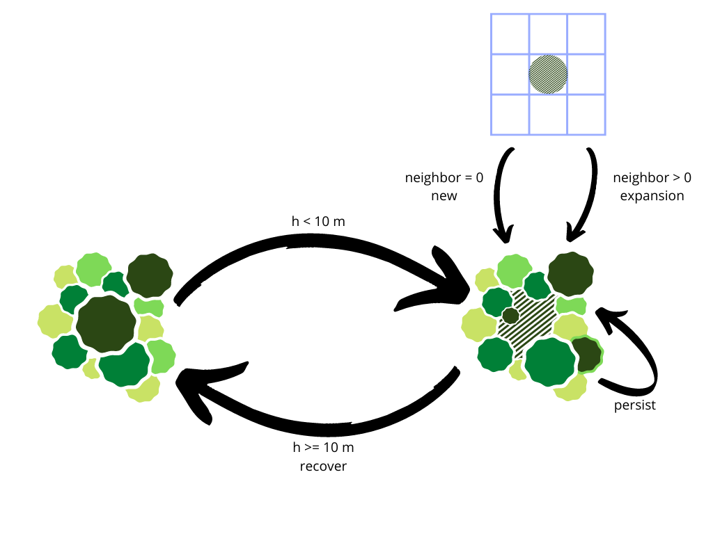

```{r}
require(raster)
```

## Dinâmica de clareira





Importa modelo digital de altura de dossel...

```{r}
chm2018 = raster('chm2018.tif')
chm2020 = raster('chm2020.tif')
```

Reamostrar e padronizar extensões tendo a camada de 2018 como referência...

```{r}
chm2020 = resample(chm2020, chm2018)
```

Criar um stack com a duas camadas.

```{r}
camadas = stack(chm2018,
                chm2020)
```

```{r}
layout(matrix(c(1,2), 1, 2, byrow = TRUE))
plot(camadas$chm2018)
plot(camadas$chm2020)
```

Calcular diferença entre chm

```{r}
camadas$diff = camadas$chm2020 - camadas$chm2018
```


```{r}
plot(camadas$diff)
```


Função de achar gap...

```{r}
findGap = function(x){ifelse(x<10, 1, 0)}
```

Create gaps mask

```{r}
camadas$gap2018 = calc(camadas$chm2018, findGap)
camadas$gap2020 = calc(camadas$chm2020, findGap)
```

Mostrar gaps 

```{r}
layout(matrix(c(1,2), 1, 2, byrow = TRUE))
plot(camadas$gap2018)
plot(camadas$gap2020)
```


Aplica função para obter visinhança

```{r}
camadas$vizinhaca = focal(camadas$gap2018, matrix(c(1,1,1,1,0,1,1,1,1), nr=3,nc=3), sum)
```


Função para aplicar regras de dinâmica em chm...

```{r}
dynamics = function(x){
  if(x[4] == 1 & x[5] == 1){
    return(1) #'persist'
  } else if (x[4] == 0 & x[5] == 0) {
    return(0) #'canopy'
  } else if (x[4] == 1 & x[5] == 0) {
    return(-1) #'recovery'
  } else {
    ifelse(x[6]>0, 3, 5) #3 if expansion, 5 if new.
  }
}
```


Computa raster de dinâmica


```{r}
camadas$dinamica = calc(camadas, dynamics)

```

Análise dos valores de dinâmica:

- Clareiras que permaneceram como clareiras = 1
- Dossel = 0
- Clareira que recuperaram = -1
- Clareiras que expandiram = 3
- Novas clareiras = 5


```{r}
plot(camadas$dinamica)
```

```{r}
freq(camadas$dinamica)
```

