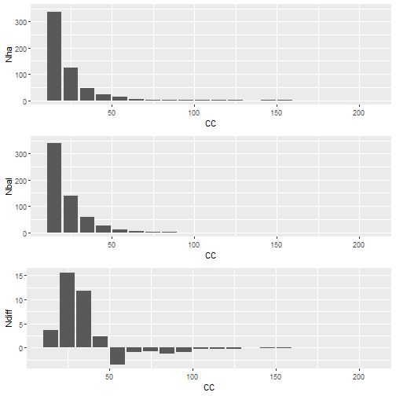
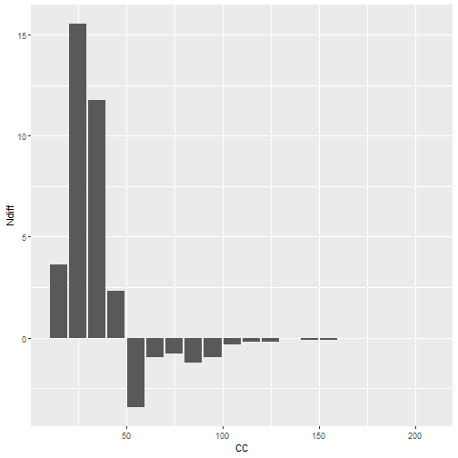

Método bdq
========================================================
author: Prof. Eric Gorgens
date: 17/05/2021
autosize: true


Agenda
========================================================

A sequência de nossa fala

- Distribuição diamétrica
- Método BDq
- Interpretação e discussão


Distribuição diamétrica
========================================================


```
    CC    Nha     AB  Vol
1   15 336.36 5.3647 54.2
2   25 125.45 5.8008 64.2
3   35  47.23 4.3616 51.3
4   45  22.68 3.4918 43.0
5   55  13.45 3.0725 39.2
6   65   4.95 1.6039 21.1
7   75   2.77 1.1861 16.0
8   85   2.23 1.2358 17.1
9   95   0.95 0.6642  9.4
10 105   0.32 0.2765  4.0
11 115   0.20 0.1804  2.6
12 125   0.20 0.2155  3.2
13 145   0.10 0.1471  2.2
14 155   0.10 0.1625  2.5
15 165   0.00 0.0960  1.5
16 205   0.00 0.1428  2.3
```


Método BDq
========================================================

1. Definir q alvo
2. Calcular b1
3. Calcular fator para cada classe diamétrica
4. Somar fator
5. Calcular área basal
6. Definir da área basal remanescente
7. Determinar b0
8. Calcular distribuição diamétrica ideal
9. Comparar distribuições diamétricas real e ideal


Definir q_alvo e calcular b1
========================================================


```r
qAlvo = 2.4
intervaloClasse = 10.0
b1 = -1*(log(qAlvo) / intervaloClasse)
b1
```

```
[1] -0.08754687
```


Fator para cada classe diamétrica
========================================================


```r
distDiam$fator = distDiam$CC^2 * exp(b1 * distDiam$CC)
sumFator = sum(distDiam['fator'])
sumFator
```

```
[1] 282.3764
```


Definição da área basal remanescente
========================================================


```r
B = sum(distDiam$AB)
intervencao = 0
Brem = B - (intervencao * B)
Brem
```

```
[1] 28.0022
```


Determinar b0
========================================================


```r
b0 = log((40000 * Brem)/(pi * sumFator))
b0
```

```
[1] 7.140947
```


Distribuição diamétrica ideal
========================================================


```r
distDiam$Nbal = round(exp(b0 + b1 * distDiam$CC), 0)
distDiam$Ndiff = distDiam$Nbal - distDiam$Nha
```


Distribuição diamétrica ideal
========================================================


```
    CC    Nha     AB  Vol        fator Nbal Ndiff
1   15 336.36 5.3647 54.2 6.051536e+01  340  3.64
2   25 125.45 5.8008 64.2 7.004093e+01  141 15.55
3   35  47.23 4.3616 51.3 5.720009e+01   59 11.77
4   45  22.68 3.4918 43.0 3.939802e+01   25  2.32
5   55  13.45 3.0725 39.2 2.452243e+01   10 -3.45
6   65   4.95 1.6039 21.1 1.427097e+01    4 -0.95
7   75   2.77 1.1861 16.0 7.916591e+00    2 -0.77
8   85   2.23 1.2358 17.1 4.236842e+00    1 -1.23
9   95   0.95 0.6642  9.4 2.205162e+00    0 -0.95
10 105   0.32 0.2765  4.0 1.122433e+00    0 -0.32
11 115   0.20 0.1804  2.6 5.610046e-01    0 -0.20
12 125   0.20 0.2155  3.2 2.761719e-01    0 -0.20
13 145   0.10 0.1471  2.2 6.451683e-02    0 -0.10
14 155   0.10 0.1625  2.5 3.071773e-02    0 -0.10
15 165   0.00 0.0960  1.5 1.450382e-02    0  0.00
16 205   0.00 0.1428  2.3 6.748034e-04    0  0.00
```


Comparar diamétrica real com ideal
========================================================




Interpretação do método BDq
========================================================


