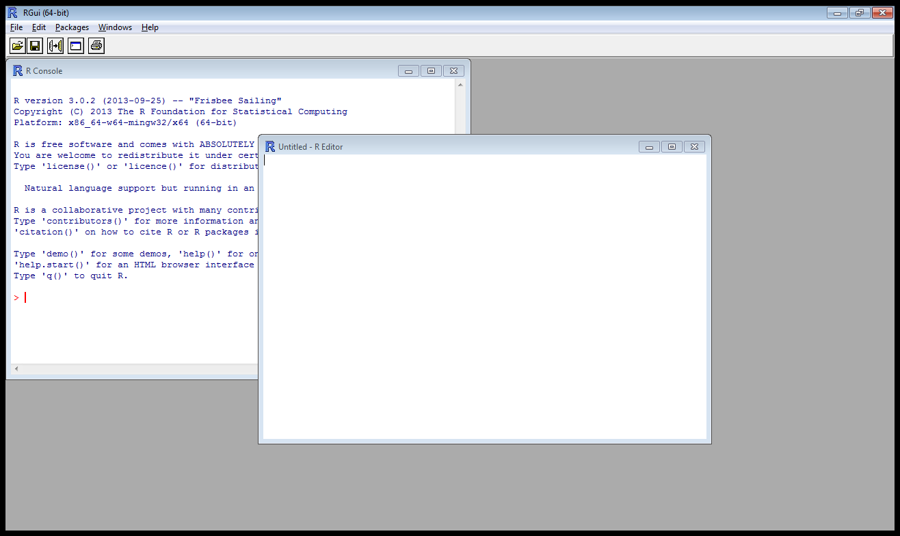
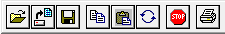
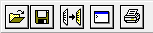
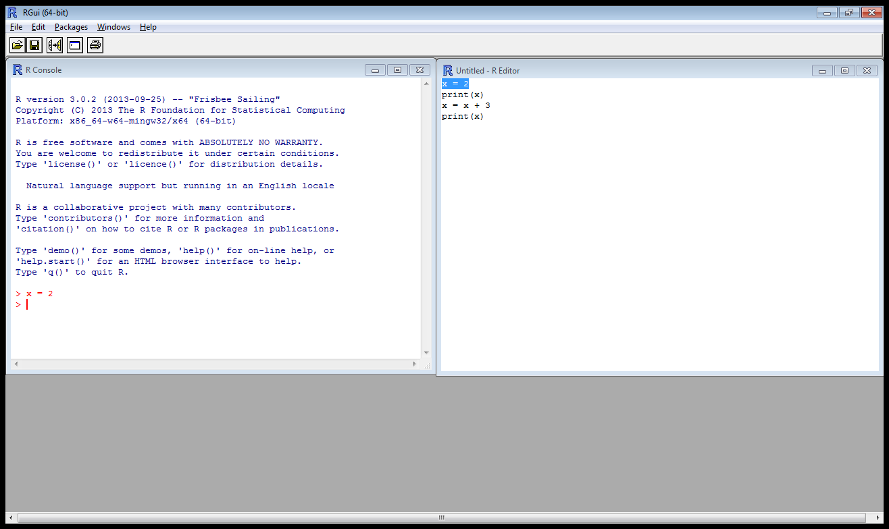
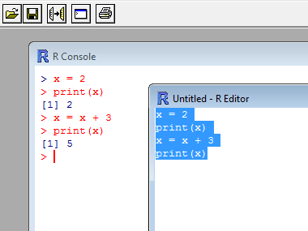
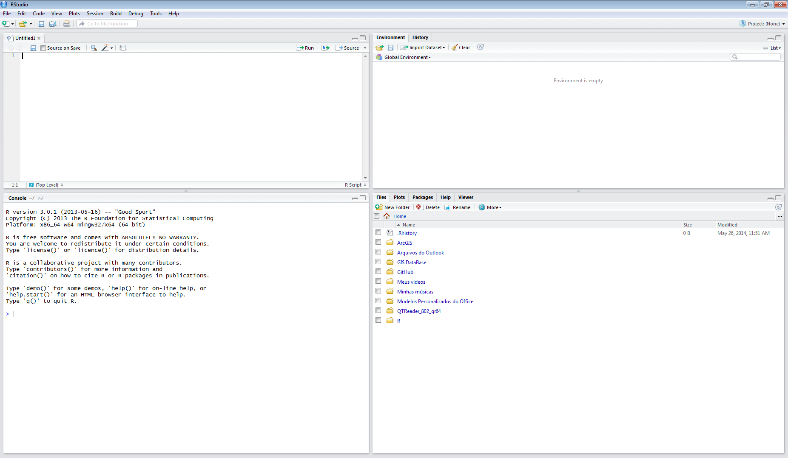

# Algumas palavras 

Neste capítulo você verá:

- Sobre o livro: \@ref(sobrelivro)
- Sobre o R: \@ref(sobrer)
	- O console: \@ref(console)
	- O Script: \@ref(script)
	- As barras de ferramentas: \@ref(barra) 
- Pacotes: \@ref(pacote)
- RStudio: \@ref(studio)

## Sobre o livro {#sobrelivro}

Bem vindo ao mundo do R. O R não é só um software, nem se resume a uma linguagem. O R é um estilo de pesquisar, estudar e ensinar. Através de seus códigos e scripts você entrará num mundo sem limites, aberto à experimentação e à exploração. Um mundo em que não existe apenas uma forma de se chegar à resposta correta!

Você deve estar se perguntando: porque começar a trabalhar com o R? A resposta passa por alguns pontos interessantes. No R, você trabalha com linhas de código e scripts; e não clicando em botões na tela. Isso pode parecer difícil, mas na verdade, esta característica lhe traz um enorme potencial e controle em relação à análise dos seus dados. 

O R quebra a dependência do usuário em clicar botões, fazendo com que cada análise seja realmente fruto de uma reflexão sobre as estatísticas e os dados. Todo o processo de criação da análise fica documentado no script, podendo ser executado a qualquer momento, por qualquer pessoa, em qualquer computador.

O usuário do R tem disponível um conjunto poderoso e versátil de ferramentas para explorar graficamente os resultados. E como veremos ao longo deste livro, antes de começar uma análise estatística, explore seus dados graficamente! Só assim você irá de fato conhecer o que você tem em mãos. As ferramentas disponíveis, passam pelo acesso a vários tipos de objetos e por diferentes modelos estatísticos.

Os mais influentes acadêmicos e pesquisadores do mundo utilizam uma linguagem de programação para desenvolver suas pesquisas. E o R é uma das principais linguagens científicas do mundo. Conhecer esta linguagem permite que você acompanhe as principais novidades relacionados à análise de dados. Atualmente já são milhares de pacotes que acrescentam funcionalidades o R. E o melhor de tudo, gratuito. Por se tratar de um projeto de código aberto, você pode usar o R sem nenhum custo adicional; ou seja sem necessidade de pagar por inscrições, assinaturas ou licenças.

```{remark}
O R é moderno, o R é flexível, o R é uma poderosa linguagem, o R é versátil e o R é grátis.
```

Com uma imensa comunidade que continua crescendo, a chance de alguém já ter encontrado a solução para um problema é muito grande. Numa das principais comunidades de usuários R (StackOverflow - maior comunidade de programadores do mundo), o tempo médio que uma pergunta leva para ser respondida é de 0,0147 dias, o que equivale a 21 minutos.
Este livro nasceu da experiência de ensinar o R para alunos de graduação e pós-graduação. Alunos que têm disposição de colocar a mão na massa e aprender fazendo. Com este propósito, todos os capítulos deste livro podem ser acompanhados na prática. Os exemplos podem ser testados, adaptados e modificados. 
Aprender uma linguagem de computação tem muitas semelhanças com o aprendizado de uma segunda língua. A principal delas é: você só aprende fazendo, por isso, pratique muito! Com o R você não está limitado por uma sequência pré-definida de rotinas. Você é capaz de criar a análise que desejar!

```{remark}
Faça download dos dados e scripts utilizados ao longo do livro em: <https://github.com/Gorgens/CompR_Introducao>.
```

Aqui, você irá aprender o essencial. Não temos a pretensão de ensinar tudo sobre o R. Nosso objetivo é fazer com que você entenda e sinta-se confortável com o ambiente R.  Para isto, usamos uma linguagem simples e direta, com exemplos e explicações sobre o que estamos digitando e executando. Seja pró-ativo! Em cada exercício, repita quantas vezes você precisar. Não avance enquanto não dominar cada um dos exercícios! Faça modificações e veja o que acontece com o resultado. Seja curioso!

```{remark}
Além deste livro, você conta com um curso online voltado para o ensino do R. O curso é gratuito e conta com vídeos e exercícios. Se inscreva em: <https://eliademy.com/catalog/catalog/product/view/sku/780afd8183.>
```

## Sobre o R {#sobrer}

O R é um programa baseado em linhas de comando. O usuário precisa criar uma linha de código e enviar para o programa executar. Ao executar uma determinada linha de código no console, o R primeiro interpreta, executa o comando e então apresenta o resultado.

Também é possível enviar para o R um conjunto de linhas, que chamamos de script. Ao processar o script, o R irá interpretar e executar linha por linha. Só depois que o processamento da primeira linha terminar, é que a segunda linha poderá ser interpretada e executada. Esta sequência segue, até que todo o script tenha sido processado.

Para que o R compreenda as linhas de comando, é fundamental que o usuário a sintaxe da linguagem. A sintaxe é uma particularidade de cada linguagem de programação, e define as regras de como os comandos precisam ser escritos para que o compilador reconheça e interprete a sentença. Uma grafia errada, ou um parâmetro faltante, faz com que interpretador retorne um erro e o programa não será capaz de executar o comando.

Se você ainda não instalou o software R, chegou a hora de fazê-lo. É possível encontrar diversos tutoriais na internet. Deixo aqui duas sugestões para você utilizar. Um tutorial escrito e um tutorial em vídeo.

1. Página: <http://www.andersonmedeiros.com/download-instalacao-sistema-r/>
2. Vídeo: <https://youtu.be/-SH3qHL2f1g>

```{remark}
Chegou a hora de instalar o R no seu computador! Uma vez instalado, você poderá acompanhar todos os exercícios do livro realizando-os diretamente em seu computador. É fundamental que você realmente coloque a mão na massa. É a única forma de aprender!
```
O R está disponível para todos os sistemas operacionais (Windows, Mac e Linux). Para realizar a instalação siga os passos abaixo:
 
1- Acesse a página do CRAN (Comprehensive R Archive Network) pelo [link](http://cran.r-project.org/mirrors.html)
2- Escolha o espelho (mirror) de acordo com sua localidade. Você será direcionado à página de download contendo a versão do R para três sistemas operacionais: Linux, Mac e Windows.
3- Faça o Download da versão mais indicada para sua máquina.
4- Clique por exemplo em ‘Download R x.x.x for Windows’, sendo que ‘x’ será equivalente à versão mais atual disponível. Salve o instalador (arquivo executável ‘.exe’) no seu computador.
5- Dê um duplo clique no instalador que acabou de baixar e inicie o processo de instalação, que será guiado por telas e caixas de opções. Para que a instalação ocorra com sucesso é importante ter uma conta de administrador. Se você não se sentir seguro com as decisões que o instalador irá solicitar, aceite as opções que estarão automaticamente selecionadas.

Para quem não quiser instalar o aplicativo, é possível rodar o R diretamente pela internet. Diferentes servidores oferecem acesso ao console do R diretamente pelo navegador. Deixo aqui duas dessas opções:

1. RFiddle: <http://www.r-fiddle.org/> (descontinuado)
2. RNotebook: <https://rnotebook.io/>

```{remark}
Fique atento! Se você optar por utilizar o R a partir de uma das soluções baseadas na internet, os passos apresentadas ao longo deste livro podem não ser os mesmos, já que os ambientes não são exatamente os mesmos.
```

A linguagem e o software possuem o mesmo nome. A linguagem R possui regras próprias, que chamamos de sintaxe. Estas regras precisam ser seguidas para assegurar que o programa interprete e processe corretamente as linhas de comando.

### Console {#console}

Ao abrir o R pela primeira vez, a janela chamada R Console estará aberta, dentro de uma janela externa maior. É no console que os comandos serão interpretados e executados.

```{r console0,fig.cap="Janela principal do software R e a janela do console.", out.width='100%', fig.asp=.75, fig.align='center', echo=FALSE}

knitr::include_graphics('img/cap2fig1.png')
```

Sempre que abrirmos o R, teremos algo parecido com o quadro abaixo impresso no console:

```{r session, echo=FALSE}
sessionInfo()
```

Veja no final do quadro a presença do sinal > que indica que o console está esperando uma nova linha de comando. Digitando o símbolo 2, seguido do símbolo *, do símbolo 3 e pressionando a tecla Enter, o R irá interpretar a linha de comando digitada, processar e então retornar o resultado 6:

```{r console1}
2 * 3
```

O que o R acabou de fazer? Ele pegou o valor 2 e multiplicou pelo valor 3, retornando um vetor contendo o resultado 6. Note, que antes do resultado 6, o R apresenta um número entre colchetes: [1]. Este número indica o índice do primeiro valor apresentado na linha impressa como resultado. Nesse exemplo, o resultado foi impresso em apenas uma linha, e a resposta 6 é o primeiro número dessa linha. Após apresentar o valor 6, que é o resultado do comando enviado, o sinal > é apresentado. Isso indica que o console está pronto para executar um novo comando.

Outro sinal que pode aparecer com frequência no console é o +. Ele aparece quando o comando foi digitado de forma incompleta. Assim, o sinal +  indica ao usuário que o console está esperando o restante do comando, para que ele possa ser então interpretado e executado. Imagine que deseja-se realizar a operação 3 * 5. No entanto, ao digitar o comando no console, teclamos Enter antes de finalizar a digitação. O console tentará processar a operação. No entanto, após o sinal *, o R espera que venha outro número. Como ele não apareceu, o R exibe um + na linha abaixo do comando digitado para informar ao usuário que algo ainda falta para que o comando possa ser interpretado. Neste momento, é possível completar a digitação incluindo 5 e teclar o Enter. O resultado esperado enfim aparece.

É muito comum que o console retorne erros quando apresentamos um comando com algum erro de lógica ou de sintaxe.  Veja o exemplo abaixo:

```{r console3, error=TRUE}
3 * a
```

Não se assuste. Geralmente a mensagem de erro tenta dar uma dica do que está acontecendo quando o console tenta interpretar o comando enviado. Leia com atenção e tente reescrever o comando enviado. No erro acima por exemplo, o objeto a não foi declarado e portanto ele não existe na memória. Corrigindo os comandos enviados ao console o erro some:

```{r console4}
a = 5
3 * a
```

### Script {#script}

Na prática, dificilmente conseguiremos realizar uma análise em apenas uma linha (um comando). É aí que entra em jogo o papel do script! Script é um conjunto de linhas de códigos e o R possui um editor de texto específico para a criação de um script. Para abrir esse editor clique em File -> New Script (Arquivo -> Novo Script). Seu ambiente de trabalho ficará assim:

```{r script0,fig.cap="Janela principal do software R, com a janela do console e a janela de script.", out.width='100%', fig.asp=.75, fig.align='center', echo=FALSE}


```

No script é possível digitarmos uma sequência de linhas que posteriormente serão apresentadas ao console. Note que o você escreve no R Editor não é processado de imediato. O processamento ocorre quando uma linha do script é enviada ao console. Apenas o console consegue interpretar e processar linhas de comando. Vamos para um exemplo. Veja o script abaixo:

```{r script1, eval=FALSE}
x = 2
print(x)

x = x + 3
print(x)
```

Como faríamos para processar o script acima? Como dissemos anteriormente, as linhas precisam ser enviadas ao console. Uma alternativa é selecionar, copiar e colar linha por linha do script para o console. Vejamos copiando e colando a primeira linha do script no console:

```{r script2}
x = 2
```

Após pressionar a tecla Enter, um novo símbolo > aparecerá abaixo da linha anterior. Isto é um bom sinal, deu certo! O R criou na memória uma variável x e assinalou a ela o valor 2. O sinal > indica que o R está pronto para receber o próximo comando! Agora, selecione, copie e cole a segunda linha do script:

```{r script3}
print(x)
```

Ao pressionarmos a tecla Enter, o console exibirá o valor que está armazenado na variável x, isto é: 2. Fácil não? Selecionando, copiando e colando a terceira linha do script, pressionando Enter. Selecionando, copiando e colando a quarta linha e pressionando Enter. Agora o resultado impresso na tela será o valor 5.

```{r script4}
x = x + 3
print(x)
```

Você consegue descrever o que o script acabou de fazer? Vamos revisar linha a linha?

1. Primeiro criamos uma variável x contendo o valor 2. Em seguida, imprimimos na tela o valor armazenado na variável x.
3. Depois pegamos o valor atual de x, adicionamos 3 e salvamos novamente em x.
4. Finalizamos pedindo para imprimir na tela o valor atual da variável x.

```{remark}
Lembre-se que o script funciona como um editor de texto. Ele não é capaz de processar nada. O console por sua vez é responsável pelo processamento do comando. Mas só pode processar um comando por vez.
```

### Barra de ferramentas {#barra}

Perceba que a barra de ferramentas é diferente quando estamos com a janela do console ativa e quando estamos com a janela do script ativa. Quando o R console está ativado (clique na janela do console), a barra de ferramentas é igual a:

```{r barra1,fig.cap="Barra de ferramentas do software R, quando o RConsole está ativo.", out.width='40%', fig.asp=.75, fig.align='center', echo=FALSE}


```

Quando o R Editor está ativado (clique na janela do editor), a barra de ferramentas muda para:

```{r barra2,fig.cap="Barra de ferramentas do software R, quando o REditor está ativo.", out.width='30%', fig.asp=.75, fig.align='center', echo=FALSE}


```

Não perderemos tempo agora, explicando cada botão das barras de ferramentas. No entanto, vale a pena conhecer o botão Run line, or selection:
 
```{r runline,fig.cap="Botão Run line.", out.width='8%', fig.asp=.75, fig.align='center', echo=FALSE}

knitr::include_graphics('img/cap2fig5.png')
```
 
Este botão pode ser usado quando queremos pegar uma ou mais linhas do script e processar no console. Basta selecionar a linha no script em questão, e clicar no botão Run line, or selection. Automaticamente a linha selecionada será enviada ao console e processada.

Veja a imagem abaixo. Nela selecionamos a primeira linha do script e clicamos no botão Run line, or selection. O comando foi processado da mesma forma de quando copiamos e colamos no console.

```{r janelas,fig.cap="Organização de janelas no Sofwtare R", out.width='100%', fig.asp=.75, fig.align='center', echo=FALSE}


```

Se selecionarmos mais de uma linha do script e pressionarmos o botão Run line, or selection, podemos enviar ao console e processar os comandos selecionados. Veja o exemplo abaixo:

```{r janelas2,fig.cap="Seleção das linhas no Script, e resultado no console após clique no botão Run line", out.width='60%', fig.asp=.75, fig.align='center', echo=FALSE}


```

```{remark}
Mesmo enviando mais de uma linha ao mesmo tempo do script para o console, as linhas serão processadas uma por vez. Se uma delas conter um erro de sintaxe, o processamento é interrompido e um erro apresentado, sem que as demais sejam processadas.
```

```{remark}
Em geral, a ausência do símbolo > indicará que estamos falando de scripts. Quando incluir o símbolo >, estamos reportando uma interação com o console.
```

## Pacotes {#pacote}

Os usuários podem criar soluções e salvá-las em forma de pacotes, que por sua vez podem ser distribuídos e adicionados por outros usuários. Os pacotes podem ser construídos integrando outras linguagens como por exemplo o JAVA, o C e o Fortran.
Para que um pacote seja distribuído pelo repositório oficial do R, é necessário que ele siga um padrão mínimo de documentação. Uma vez listado no repositório oficial, o pacote fica disponível para download através dos espelhos do servidor do CRAN (The Comprehensive R Archive Network).
A instalação de um pacote pode ser feita através de um comando específico ou através do menu de opções do R.  O ggplot2, por exemplo, é um pacote gráfico que pode ser adicionado ao R via instalação de pacotes. Assim, para instalarmos este pacote através de linha de comando, devemos digitar no console a linha:

```{r instalando, eval=FALSE}
install.packages("ggplot2")
```

```{remark}
Não esqueça que no comando install.packages() o nome do pacote tem que vir entre aspas.
```

```{remark}
Na primeira vez que este comando for utilizado, o R irá perguntar de qual espelho o download de pacotes deverá ser feito. Recomendo que escolha um espelho próximo de onde você mora, para que o download seja mais rápido.
```

No entanto, mesmo que um pacote esteja instalado, ele não fica automaticamente carregado. Para que sua funcionalidade torne-se disponível é necessário carregar o pacote sempre que se inicia o R. Se desejarmos carregar o pacote ggplot2 instalado há pouco, devemos digitar no console o comando:

```{r require, eval=FALSE}
require(ggplot2)
```

```{remark}
Diferentemente da função install.packages(), a função require() não requer que o nome do pacote seja apresentado entre aspas.
```

Outra opção é utilizar o menu de opções do R, clicando na opção Packages e depois Install packages(s):

```{r pacotes0,fig.cap="Instalando pacote pelo menu de opções no software R", out.width='100%', fig.asp=.75, fig.align='center', echo=FALSE}

knitr::include_graphics('img/cap6fig1.png')
```

Na primeira vez que você for instalar um pacote, o R irá mostrar uma lista dos servidores do CRAN disponíveis. Escolha uma das opções apresentadas e clique Ok. Dê preferência por servidores próximos de você.

```{remark}
Recomendo que escolha um espelho próximo de onde você mora, para que o download seja mais rápido.
```

```{r pacotes1,fig.cap="Escolhendo o espelho para download de pacotes", out.width='100%', fig.asp=.75, fig.align='center', echo=FALSE}

knitr::include_graphics('img/cap6fig2.png')
```

Após escolher o servidor, aparecerá uma nova lista contendo os pacotes disponíveis para instalação. Escolha um ou mais e clique Ok.

```{r pacotes2,fig.cap="Lista de  pacotes disponível no reposiório oficial", out.width='100%', fig.asp=.75, fig.align='center', echo=FALSE}

knitr::include_graphics('img/cap6fig3.png')
```

## Rstudio {#studio}

O RStudio é um ambiente de desenvolvimento integrado para tornar a vida do usuário do R mais poderosa e produtiva. Ele é gratuito para uso não comercial, tem código aberto e pode ser instalado nas plataformas Windows, Mac e Linux.

A instalação do RStudio é muito simples. Ao acessar a página http://www.rstudio.com/products/RStudio/#Desk, escolha a opção que melhor se ajusta ao seu sistema operacional. Baixe o instalador e siga as orientações do assistente de instalação.

```{remark}
Vale lembrar que primeiro você precisa instalar o R. E em seguida instale o RStudio.
```

Pode ser necessário possuir a licença de administrador para que o R consiga associar corretamente sua extensão na configuração interna do seu sistema operacional. Quando se trabalha no RStudio, não é necessário abrir o R, pois o RStudio já comunica automaticamente com ele.

Tudo que você faz no RStudio, você é capaz de fazer diretamente no R. Assim, você deve estar se perguntando: por que então utilizar o RStudio? A resposta é: porque a interface gráfica é mais amigável e organizada, facilitando o seu dia-a-dia. De qualquer maneira, gosto não se discute. Utilize aquele que lhe proporcionar mais conforto. Vamos conhecer então, um pouco mais do ambiente do RStudio. 

```{r rstudio0,fig.cap="Logo oficial do RStudio", out.width='20%', fig.asp=.75, fig.align='center', echo=FALSE}


```

Ao abrir o RStudio pela primeira vez, clicando no ícone semelhante à figura acima, você estará utilizando uma interface gráfica composta de 3 janelas:

```{r rstudio1,fig.cap="Ambiente inicial da IDE RStudio", out.width='100%', fig.asp=.75, fig.align='center', echo=FALSE}

knitr::include_graphics('img/cap7fig2.png')
```

Na janela da esquerda você está vendo o console, que possui a mesma função do console do R. Ou seja, é nele onde os comandos são processados. O console do RStudio apresenta a versão do R instalada em seu computador.

```{r rstudio2, echo=FALSE}
sessionInfo()
```

Na janela superior direita, você encontra duas abas: o Environment (Ambiente) o History (histórico). A aba Environment mostra todas as variáveis que estão criadas e armazenadas na memória flutuante do seu computador. Esta memória flutuante é também conhecida como memória RAM. Assim, o seu computador pode apresentar lentidão, ou até mesmo travar se suas variáveis ocuparem um espaço superior à memória RAM disponível.

A aba History armazena todas as linhas que foram processadas no seu console. Assim, você pode facilmente recuperar uma linha ou comando processado anteriormente.

Na janela inferior direita você encontra cinco abas: Files (arquivos), Plots (gráficos), Packages (Pacotes), Help (Ajuda) e Viewer (Visualizador). Por hora, precisamos saber que o Files irá mostrar todos os arquivos e pastas presentes no meu Workspace (Espaço de trabalho – veremos mais sobre ele no próximo capítulo). As abas Plots e Viewer servem para visualizarmos os resultados gráficos das nossas análises. Ao longo deste livro, utilizaremos apenas a aba Plots. Na aba Packages podemos gerenciar os pacotes disponíveis para o R, instalando, ativando e removendo pacotes. Por fim, a aba Help permite acessar a documentação dos pacotes e funções, para consultar a sintaxe, explicações e exemplos de uso.

Também é muito comum utilizarmos a interface do RStudio com 4 janelas. Neste caso, o console passa a ocupar a janela inferior esquerda, e o Editor de scripts passa a ocupar a janela superior esquerda.

```{r rstudio3,fig.cap="Ambiente inicial da IDE RStudio, com as quatro principais janelas.", out.width='100%', fig.asp=.75, fig.align='center', echo=FALSE}


```

O uso do script e console dentro do RStudio é idêntico ao que vimos no capítulo Sobre o R. Assim, se ficou alguma dúvida, faça uma releitura do capítulo, só que agora realizando os exemplos no RStudio.

```{remark}
De agora em diante, os exemplos serão conduzidos no RStudio, mas nada impede que você continue utilizando o R.
```
