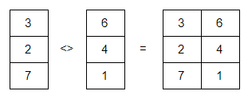

# Variáveis e operadores

Neste capítulo você verá:

- Tipos de objetos: \@ref(objetos)
	- Vetor: \@ref(vetor)
	- Matriz: \@ref(matriz)
	- Dataframe: \@ref(df)
	- Lista: \@ref(lista)
	- Deleter variáveis: \@ref(delete)
- Operadores matemáricos: \@ref(matematicos)
	- Soma: \@ref(sum)
	- Subtração: \@ref(sub)
	- Multiplicação: \@ref(multi)
	- Divisão: \@ref(div)
	- Resto da divisão: \@ref(reminder)
	- Exponenciação: \@ref(exp)
	- Raiz quadrada: \@ref(
	- Logaritmo: \@ref(log)
	- Armazenamento de variáveis: \@ref(armazem)
- Operadores lógicos:\@ref(logicos)  

## Tipos de objetos	{#objetos}
	
O R possui diferentes objetos, que possuem propriedades que irão influenciar o que você pode ou não pode fazer com os seus dados. Uma variável que for criada como matriz, não possui as mesmas propriedades de uma variável do tipo lista. Por exemplo, não é possível realizar a soma de um objeto numérico com um objeto de texto. Estes dois objetos não possuem as mesmas propriedades!

Em essência, os objetos são criadas para armazenar dados. Estes dados geralmente podem ser definidos como numéricos (inteiros ou decimais), caracteres (string) ou lógicos. Alguns objetos permitem que diferentes tipos de dados sejam armazenados ao mesmo tempo. Outros objetos permitem que apenas um tipo de dado possa ser armazenado.

### Vetor {#vetor}

Na linguagem R, não é necessário declarar o objeto a uma variável antes dela ser criada. O R tentará determinar o melhor objeto com base nos dados atribuídos à variável. Vejamos o seguinte comando:

```{r vetor0, eval=FALSE}
x = 2
```

O sinal = é a representação do termo atribuição, e pode ser substituído pelo sinal <-. Portanto, o comando abaixo equivale ao comando anterior:

```{r vetor1, eval=FALSE}
x <- 2
```

Os comandos acima são equivalentes e podem ser interpretados como: atribua o valor 2 à variável x. Ao criar a variável x, o R irá definir x como numérico e armazenar num objeto do tipo vetor. Vetor é o objeto mais simples que uma variável pode assumir, e somente pode armazenar um mesmo tipo de dado. Isto é, um vetor pode conter apenas números, ou apenas texto, ou apenas data, e assim por diante. Vejamos um novo exemplo:

```{r vetor2}
a = 20.7
```

```{remark}
O R trabalha com padrão internacional de separação decimal e separação de colunas. A separação decimal é ‘.’ (ponto). E a separação de coluna é ‘,’ (vírgula).
```

Digitando a função str() para a variável a, é possível verificar que a variável de fato foi definida como numérica, e  armazenada num vetor de um único elemento.

```{r vetor3}
str(a)
```

O principal atributo de um objeto do tipo vetor é o comprimento. O vetor a possui comprimento 1, ou seja, contém apenas um elemento. Isto pode ser comprovado através da função length():

```{r vetor4}
length(a)
```

Vamos criar um script com 4 linhas de comando que atribuem alguns valores a quatro diferentes variáveis: 

```{r vetor5, results='hide'}
a = 2
b = c(1, 2, 3)
idade = c(2, 4, 3)
experiencia = c(1, 5, 7)
```

Selecione as linhas do script e processe no console. Note, que quando você quer criar um vetor com mais de um elemento, é necessário utilizar a função c(). A nome desta função vem de components (do inglês componentes). Assim, ao utilizar a função c() você está pedindo ao R que construa um vetor com os componentes listados dentro da função.

Após rodar o script acima, você não vê, mas agora existe na memória do seu computador as variáveis: a, b, idade e experiencia. Chamando a função length() para cada uma das variáveis, você descobrirá que o vetor a possui comprimento igual a 1, portanto é um vetor de apenas uma unidade. Já os vetores b, idade e experiencia possuem comprimento 3 e portanto são vetores compostos por 3 elementos.

```{r vetor5b}
length(a)
```

```{r vetor6}
length(b)
```

```{r vetor7}
length(idade)
```

```{r vetor8}
length(experiencia)
```

Todos os quatro vetores são vetores numéricos e portanto, podem participar de operações matemáticas. Vetores de texto, como veremos mais adiante, não poderiam ser usados para operações matemáticas. Mas não vamos nos preocupar agora com as operações matemáticas. Logo voltaremos neste assunto.


### Matriz {#matriz}

Agora imagine que você tenha dois vetores com três elementos cada um, e combine lado a lado na vertical estes dois vetores. O que acontece?

```{r matriz0,fig.cap="Ilustração da construção de uma matriz a partir de vetores.", out.width='50%', fig.asp=.75, fig.align='center', echo=FALSE}


```

Você acaba de criar uma matriz de duas colunas e três linhas. E se você combinar estes dois vetores de três elementos na horizontal, um acima do outro? Você cria uma matriz com duas linhas e três colunas. Esta "combinação" de vetores só funciona quando os elementos dos vetores possuem o mesmo tipo de dado, ou seja, somente números ou somente caracteres!

Matrizes nada mais são que combinações de vetores com o mesmo comprimento e tipo de dado. As variáveis estruturadas como matriz possuem portanto uma característica que o vetor não tem: dimensão. A dimensão é uma característica que indica quantas linhas e quantas colunas a matriz possui. Vamos criar uma matriz e armazená-la na variável m1:

```{r matriz1}
m1 = matrix(c(2, 4, 3, 1, 5, 7), nrow = 2, ncol = 3, byrow = TRUE)
```

Qual a dimensão desta matriz? Se você respondeu 2 x 3, acertou! A função dim() retorna a dimensão de uma matriz. Agora rode o comando e tire a prova:

```{r matriz2}
dim(m1)
```

A resposta é um vetor de dois elementos. O primeiro elemento - [1], de valor 2, indica o número de linhas. O segundo elemento - [2], de valor 3, indica o número de colunas. Logo, temos uma matriz 2x3. Vamos exibir a matriz para verificar visualmente se o número de linhas e de colunas bate com o resultado da função dim().

```{r matriz3}
m1
```

Nossa matriz m1 realmente possui duas linhas e três colunas. Perceba também, que os três primeiros elementos (2, 4, 3) do vetor informado durante a criação da matriz foram organizados ao longo da primeira linha, e os três últimos elementos (1, 5, 7) foram organizados ao longo da segunda linha. Isto aconteceu porque pedimos que o parâmetro byrow da função matrix() fosse TRUE (verdadeiro). E se criarmos uma nova matriz m2 com o mesmo comando da m1, mas alterando o parâmetro byrow para FALSE (falso)?

```{r matriz4}
m2 = matrix(c(2, 4, 3, 1, 5, 7), nrow = 2, ncol = 3, byrow = FALSE)
m2
```

O acesso a elementos de um vetor ou de uma matriz se dá através do cruzamento da(s) linha(s) e coluna(s). A notação utilizada é com o uso dos colchetes - [referência de linha, referência de coluna], logo após o nome da matriz que se deseja manipular. Execute linha a linha do script abaixo no seu console. Veja que estamos buscando diferentes números da matriz m1.

```{r matriz5}
m1[1,1]
m1[1,]
m1[,2]
m1[2, 1:2]
```

Na linha 1 do script, o comando m1[1,1] pede para o console exibir o elemento da matriz que está na linha 1 e na coluna 1. Na segunda linha, o comando m1[1,] solicita que sejam exibidos todos os elementos da linha 1. Na terceira linha, o comando m1[,2] solicita que sejam exibidos todos os elementos da segunda coluna. Na última linha, o comando m1[2, 1:2] solicita que sejam exibidos os elementos da linha 2 e presentes nas colunas 1 até 2. Veja que cada símbolo possui um papel específico para resgatar valores dentro de um vetor ou matriz. Vejamos cada comando com seu respectivo resultado:

```{r matriz6}
m1[1, 1]
```

```{r matriz7}
m1[1,]
```


```{r matriz8}
m1[, 2]
```


```{r matriz9}
m1[2, 1:2]
```

### Dataframe {#df}

Dataframe é uma condição especial de combinação lado a lado de vetores verticais. Ao contrário das matrizes, o dataframe não exige que os vetores tenham os mesmos tipos de dado. Assim, por exemplo, a primeira coluna do dataframe pode de números, a segunda coluna pode ser de texto, a terceira coluna de data, e assim por diante.

O R possui algumas bases de dados, já estruturadas como dataframe, que vem automaticamente quando o software é instalado. Estes dataframes são geralmente usados como exemplos nos tutoriais e arquivos de ajuda. Vamos conhecer uma dessas bases, a mtcars.

```{r df0, results = 'hide'}
data(mtcars)
```

Após digitar o comando acima em seu console, você terá criado uma variável na memória chamada mtcars contendo os dados sobre carros de diferentes marcas. Como exemplo, vamos usar a função head() para visualizar as 6 primeiras linhas desse dataframe:

```{r df1}
head(mtcars)
```

Visualizando apenas as 6 primeiras linhas do dataframe mtcars podemos perceber que esta é a estrutura de dados no R que se assemelha às planilhas eletrônicas como o Excel. Assim, podemos entender o dataframe como uma sequência de observações (linhas) de determinadas variáveis (colunas). 

Como as matrizes, o dataframe também possui o atributo dimensão, que pode ser acessado pela função dim():

```{r df2}
dim(mtcars)
```

Veja a seguir outros comandos úteis para serem usados com um dataframe. Teste cada um deles com o dataframe mtcars:

```{r df3}
# retorna as 6 últimas linhas do dataframe
tail(mtcars)

# retorna o nome das colunas do dataframe
names(mtcars)

# retorna um resumo estatístico das colunas do dataframe
summary(mtcars)
```

```{remark}
No script acima aproveitamos para apresentar a sinalização de comentário. Toda linha no R iniciada com o # não é interpretada pelo console. Assim, o símbolo # é útil para incluirmos comentários em nosso código. Veja que no script acima, antes de cada função existe um comentário que explica o que cada função irá fazer.
```

Assim como vetores e matrizes, podemos utilizar a notação de colchetes - [ ] para acessar qualquer registro dentro de um dataframe. Vejamos a terceira coluna do mtcars:

```{r df4}
mtcars[, 3]
```

```{remark}
Note que o comando mtcars[,3] retorna a terceira coluna do dataframe. Cada linha do resultado inicia-se com um número entre colchetes. Este número indica qual a posição do primeiro número dentro do vetor que está sendo apresentado. Por exemplo, o número 160.0 é o primeiro elemento do vetor que representa a terceira coluna. O número 275.8 é o décimo terceiro elemento do vetor que representa a terceira coluna. O número 400.0 é o vigésimo quinto elemento. Estes número podem variar de computador para computados, em função do tamanho da janela disponível para impressão dos resultados.
```

```{r df5}
mtcars[3, 3]
```

```{r df6}
mtcars[1,]
```

```{r df7}
mtcars[1:3,]
```

Outro recurso poderoso do R são os filtros, que podem ser implementados utilizando a notação de colchetes - [ ] ou então a função subset(). Imagine que queremos filtrar os carros que possuem o valor 4 na variável cyl, que indica cilindrada do carro (em 1000 unidades). Vejamos primeiro o uso da função subset():

```{r df8}
subset(mtcars, mtcars$cyl == 4)
```

Agora, vejamos como seria o filtro com a notação de colchetes:

```{r df9}
mtcars[mtcars$cyl == 4,]
```

Agora, imagine que queremos ver apenas as variáveis mpg e hp das observações que possuem cyl igual a 4. Primeiro utilizando a função subset():

```{r df10}
subset(mtcars, mtcars$cyl == 4, select = c("mpg", "hp"))
```

Agora utilizando a notação de colchetes:

```{r df11}
mtcars[mtcars$cyl == 4, c(1, 4)]
```

Agora é só usar a imaginação e filtrar os dados como melhor lhe convier!


### Lista {#lista}

O último objeto que iremos ver são as listas. Listas funcionam como um varal. Num varal podemos pendurar vários coisas. Você pode pendurar roupas, quadros, tênis, fotos e várias outras coisas que você nem imagina! No R, a lista funciona da mesma forma. Você pode incluir numa lista diferentes dados e objetos. 

Lembra-se das variáveis a e idade que criamos anteriormente? Pois bem, vamos adicioná-las juntamente com o dataframe mtcars a uma lista chamada dados.

```{r lista0}
dados = list(mtcars, a, idade)
```

Agora, a lista dados possui na sua posição 1 o dataframe mtcars, na sua posição 2 o vetor a e na posição 3 o vetor idade. Para recuperar o objeto de uma lista, devemos utilizar a notação de duplo colchete - [[ ]]. Veja o exemplo para recuperar o objeto salvo na posição 3 da lista dados:

```{r lista1}
dados[[3]]
```

### Deletando variável {#delete}

Ao longo deste capítulo, criamos na memória do nosso computador diversas variáveis. Você consegue se lembrar de todas elas? Não se preocupe. A função ls() faz isto para você:

```{r delete0}
ls()
```

E se não quisermos mais a variável x? Sem problemas, podemos deletar através do comando rm():

```{r delete1}
rm(x)
```

Se quiser excluir todas as variáveis da memória, basta usar o comando:

```{r delete2, eval=FALSE}
rm(list = ls(all=TRUE))
```

Como este livro é para ensinar os primeiros passos, o que você viu até aqui são os objetos e tipos de dados mais utilizados. Mas existem outros que com o passar do tempo, você terá a oportunidade de aprender!


## Operadores matemáticos {#matematicos}

Agora que você já está se acostumando ao R, chegou a hora de aprender a notação dos principais operadores matemáticos. Para os exemplos abaixo, crie as seguintes variáveis:

```{r operadores0}
a = 2
b = 100
c = c(1, 2, 3, 4, 5)
```

Vamos agora utilizar as variáveis acima e ver diversos exemplos de cada um dos operadores matemáticos.

### Soma {#sum}

```{r operadores1}
a + 10
```
	
```{r operadores2}
a + b
```
	
```{r operadores3}
a + b + 102
```
	
```{r operadores4}
d = c + 10
d
```

### Subtração {#sub}

```{r operadores5}
a - 10
```

```{r operadores6}
a - b
```
	
```{r operadores7}
a + b - 102
```

```{r operadores8}
c - 10
```

### Divisão {#div}

```{r operadores9}
b / 10
```
	
```{r operadores10}
a / b
```
	
```{r operadores11}
a + b / 10
```
	
```{r operadores12}
(a + b) / 10
```

```{remark}
A divisão e multiplicação têm preferência sobre a adição e subtração. Para alterar prioridades, utilize os parênteses - ().
```

### Multiplicação {#multi}

```{r operadores13}
b * 10
```
	
```{r operadores14}
a * b
```
	
```{r operadores15}
a + b * 10
```
	
```{r operadores16}
(a + b) * 10
```

### Exponenciação {#exp}

```{r operadores17}
a^2
```
	
```{r operadores18}
a^b
```
	
```{r operadores19}
a^-1
```
	
```{r operadores20}
c^2
```

```{remark}
Quando o número é muito alto ou muito pequeno, o R apresenta o valor em notação científica, utilizando o termo e+. Isto indica que o número apresentado deve ser multiplicado por 10 tantas vezes quanto o número que acompanha e+. Assim 1.267651e+30 equivale a 1.267651x10^30^
```

```{remark}
A exponenciação tem preferência sobre a divisão e multiplicação. Que por sua vez têm preferência sobre a adição e subtração. Para alterar prioridades, utilize os parênteses - ().
```

### Resto da divisão (reminder) {#reminder}

A maioria das pessoas não está acostumada a usar o resto da divisão. No inglês, chamamos este operador de reminder. Um exemplo de uso do operador reminder é para determinar se um número é par ou ímpar. Imagine um número qualquer x. Se a divisão de x por 2 tiver resto zero, x é par. Se o resto da divisão for diferente de zero, x é ímpar. Veja alguns exemplos de como obter o resto de uma divisão: 

```{r operadores21}
10 %% 2
```
	
```{r operadores22}
11 %% 2
```
	
```{r operadores23}
11 %% 3
```

### Raiz quadrada {#sqrt}

A raiz quadrada pode ser obtida por duas formas. A primeira é através da operação de exponenciação, lembrado que a raiz quadrada de x, por exemplo, é equivalente à x elevado a 0,5. Outra alternativa é uma função sqrt().

```{r operadores24}
sqrt(4)
```
	
```{r operadores25}
4^(1/2)
```

```{remark}
Prefira a forma de exponenciação, quando precisar realizar a raiz de outros números. Por exemplo, a raiz cúbica de 8.
```

```{r operadores26}
8^(1/3)
```

### Logaritmo {#log}

O logaritmo também é uma operação que o R realiza através de funções, que no caso é a função log(). Esta função possui um parâmetro opcional que é a base.  Quando nada é informado, a base é automaticamente definida como número de Euller, retornando portanto o logaritmo natural.

```{r operadores27}
log(10)
```
	
```{r operadores28}
log(10, 10)
```
	
```{r operadores29}
log(8, 2) 
```

Veja que passamos pelos principais operadores matemáticos. É claro que os exemplos aqui descritos são simples e servem para você aprender a como chamá-los no R. 

### Armazenando em variáveis {#armazem}

Falar....

## Operadores lógicos {#logicos}

Os operadores lógicos são utilizados para verificar se uma relação é verdadeira ou falsa. Assim em função da condição estabelecida, o R retorna TRUE (verdadeiro) ou FALSE (Falso). O uso isolado dos operadores lógicos não faz muito sentido e geralmente são estruturas utilizadas para a construção de filtros para matriz e dataframe, e para direcionar fluxo com o operador if.

O controle de fluxo if é usado para definir uma ação em função do resultado de um operador lógico. Por exemplo, se a altura de uma árvore for maior ou igual a 2 metros, calcula-se o volume da mesma, caso a altura seja inferior a 2, atribui-se o valor 0 para volume.

Veremos a estrutura if com mais profundidade ao final deste capítulo. Mas a título de ilustração, vamos ver como ficaria o script do exemplo acima:

```{r if0, eval=FALSE}
if(altura >= 2){
	volume = diametro * altura * fatorForma
} else {
volume = 0
}
```

A seguir, vamos conhecer os principais operadores lógicos. Para isto, vamos criar algumas variáveis que utilizaremos para exemplificar os testes lógicos.

```{r logico0}
dap1 = 10.2
dap2 = 14.3
ht1 = 15
ht2 = 15
parcela1 = c(10, 14, 12, 16)
parcela2 = c(11, 11, 11, 11)
incremento = 4.3
parcela3 = c(18, 13, 11, 12)
```

### Igualdade


```{r logico1}
dap1 == dap2
```
	
```{r logico2}
ht1 == ht2
```

### Diferente

```{r logico3}
length(parcela1) != 1
```
	

```{r logico4}
dap2 != (10 + incremento)
```

### Maior 

```{r logico5}
length(parcela1) > 3
```
	
```{r logico6}
dap1 > incremento
```
	
```{r logico7}
length(parcela1) > length(parcela2)
```

### Maior ou igual

```{r logico8}
length(parcela3) >= 4
```
	
```{r logico9}
4 >= length(parcela2)
```
	
```{r logico10}
length(parcela1) >= length(parcela2)
```


### Menor

```{r logico11}
dap1 < dap2
```
	
```{r logico12}
dap2 < dap1 + incremento
```
	
```{r logico13}
ht1 < ht2
```


### Menor ou igual

```{r logico14}
dap1 <= dap2
```
	
```{r logico15}
dap1 <= dap2 + incremento
```
	
```{r logico16}
ht2 <= ht1
```

### Estar contido

Outro operador lógico muito útil é o operador "estar contido". Por exemplo, você pode querer verificar se um determinado número está contido num determinado vetor. Vejamos um exemplo:

```{r logico17}
vetor = c(4, 10, 56, 78, 91)
numero = 10
numero %in% vetor
```

### Operadores E e OU

É possível combinar operadores lógicos utilizando-se os conectores E e OU. O conector E é representado pelo símbolo & e ele verifica se as duas condições são atendidas simultaneamente. Vejamos um exemplo com as variáveis:

```{r logico18}
largura = 10
comprimento = 20
largura2 = 100
```

```{r logico19}
(largura == largura2/10) & (comprimento == largura/2)
```

```{r logico20}
(largura == largura2/10) & (largura == comprimento/2)
```

O conector OU, cujo símbolo é |, verifica se pelo menos uma das condições é verdadeira:

```{r logico21}
largura = 10
comprimento = 20
largura2 = 100
```


```{r logico22}
(largura == largura2/10) | (comprimento == largura/2)
```
	
```{r logico23}
(largura == largura2/10) | (largura == comprimento/2)
```

### Controle de fluxo (if)

Agora, que entendemos melhor como funcionam os operadores lógicos, podemos avançar na compreensão dos controladores de fluxo (if). Eles são muito utilizados quando dentro do código precisamos analisar uma condição e tomar uma decisão de acordo com o resultado desta condição. Veja o exemplo apresentado no início deste capítulo. Qual o volume se a nossa árvore possui altura de 10 metros, diâmetro de 20 centímetros e um fator de forma de 0.5? 

```{r if1, results='hide'}
altura = 10
diametro = 20
fatorForma = 0.5
if(altura > 2){
	volume = (pi * (diametro^2) / 40000) * altura * fatorForma
} else {
	volume = 0
}
print(volume)
```


Ao rodar o script acima, o resultado exibido no console será:

```{r if2, echo = FALSE}
altura = 10
diametro = 20
fatorForma = 0.5
if(altura > 2){
	volume = (pi * (diametro^2) / 40000) * altura * fatorForma
} else {
	volume = 0
}
print(volume)
```

Agora vamos aproveitar, e incluir mais uma condição. Imagine agora que árvores com altura igual ou maior que 9 metros tenham um fator de forma de 0.75 e árvores entre 2 e 9 metros tenham fator de forma de 0.5. Nosso script passa a ser:

```{r if3}
altura = 10
diametro = 20
fatorForma = 0.5
if(altura >= 9){
	volume = (pi * (diametro^2) / 40000) * altura * 0.75
} else if ( altura > 2 & altura < 15){
	volume = (pi * (diametro^2) / 40000) * altura * 0.5
} else {
	volume = 0
}
print(volume)
```
